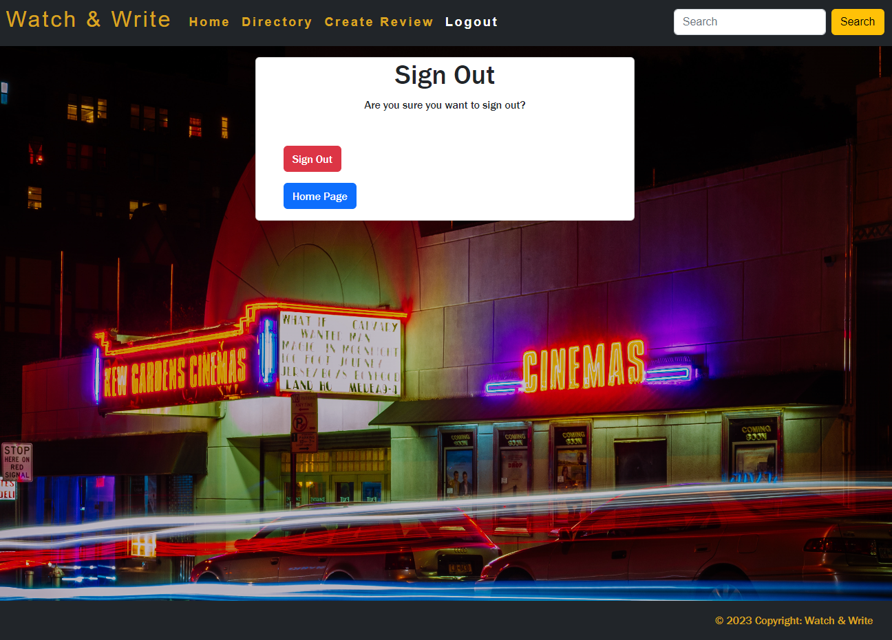

# **Watch & Write**

## Code Institute Portfolio Project 4 - a Full Stack website using the Django framework and a database

# **Table of Contents**

# **Scope**
The project is meant to showcase my skills as a developer using the Python Django Framework. The website will function as a review site for people who are passionate about movies.
  
The project will use the Django AllAuth library to allow users to create accounts and log in to the website. Once they have logged in, users will be able to post reviews of movies to help other users to find worth while movies to watch. Logged-in users will also be able to like these reviews, and post comments. Users will be able to update and delete their own reviews.
  
The project will also feature several mechanisms for searching, sorting and filtering database entries.
  

# **Background**
This project was inspired by the fact that I can never decide what movie to watch and would need more data to make better decisions in my movie selecting.
 
 
[This is the repository](https://github.com/Linber93/watch_and_write)
 
 
[This is the deployed site on Heroku](https://watch-and-write.herokuapp.com/)
 
 
In the time we live in with the amount of streaming services and amount of movies available it is harder than ever to find good movies. this website provides a little more data to find good movies

# **Audience / Users**

This project aims to allow movie enthusiast to share their opinions and the average person recommendations on what to watch.

# **User Stories**

## **Admin User Stories**

- As an Admin I can...
    - Navigate to the admin sign-in page, so that I can sign in to the admin panel
    - Sign-in via the admin sign-in page so that I can access the admin panel
    - create, read, update and delete comments so that I can manage the sites content
    - create, read, update and delete reviews so that I can manage the sites content
    - approve/disapprove comments so that I can filter out unwanted comments
    - create a draft review so that I can edit the content later
    - approve/disapprove reviews so that I can filter out unwanted or questionable reviews
    - View all signed up users so that I can see how popular the site is
    - Delete Users, So that I can prevent malicous users from submittingh comments and reviews

## **Generic User Stories**

- As a Generic user I can...
    - Immediately determine the purpose of the application when first visiting, so that I can quickly decide whether to stay or leave
    - View all movie reviews so that I can choose one to read in full
    - View any single movie review in its entirety so that I can read the full content
     - Use a search function to search for movie reviews using keyword terms so that I can get a collection of reviews to read
        - If my search returned no results, have that reflected back to me, so that I can search by different parameters

## **Unregistered User Stories**

- As an unregistered user I can...
    - Sign-up and create an account, so that I can access the full functionality of the application
    - Sign-in to that created account, so that I can access the full functionality of the application

## **Registered User Stories**

- As a registered user I can...
    - Sign in to a previously created account, so that I can get full functionality of the application

## **Rejected User Stories**

These user stories were not implemented due to the features were do difficult to implement

- Rejected User stories
    - As a user can change the password for that account, so that it becomes more memorable
    - As a user i can upvote comments, so that I can show my approval of comments I agree with

# **Features**

This section covers the features, pages, views and forms of the project explaining some of the design choices.

## **Base**
The project is using a base template file which is used on every page. This provides a consistent user experience. This also allow easy maintenance due to only having to make changes in one file to change the overall look of the included elements. The template includes a Bootrap navbar and a small footer. The HTML code from other templates is injected into the 'main' element. 

## **Header and Navbar**
The navbar allows easy navigation throughout the site. It was created using a standard bootstrap navbar to allow easy responsiveness on different screensizes. The links was given some modifications to easier identify which page you are currently on and which link you are currently hovering over.

The user can also use the searchbar to find movies directed by certain directors, including specific actors or reviews created by a specific user.

If the user is not signed in links to the signup page or login page will also be shown in the navbar. Once signed in the user will get new links including the option to create a review by themselves or logout.

On smaller devices the navbar will instead be a collapsible navbar that will drop down on request.

## **Footer**
The footer is just a basic small footer only containing copyright information.

## **Landing Page
The landing page is the first template to be rendered to the user once the first visit the deployed project [Watch & Write](https://watch-and-write.herokuapp.com/).
It is rendered from "templates/index.html" using the "LandingPage" view. The main content is a carousel showing recent reviews. Each item in the carousel can be clicked to be taken to the detailed version of the review.

## **Directory**
The directory is containing cards of each review in cards generated through a for loop going through the "reviews" table. displaying them 6 at a time with the rest with paginated.

## **Single Review**
The single review page is to display a single review in its entirety, Rendering from the "templates/single.html" template and the "ReviewSingle" view. The review is contained within a bootstrap card containing Title, Director, Actors, Plot, Release year, Opinion and a Rating given by the reviewer. It also includes comments by other users.

The single review also checks if the user is also the author of the review, Allowing them to Edit or Delete using buttons only displayed if they are the author.

If the user wants to post a comment on that review, It either prompts them to sign in or if already sign in display a inputfield where the user can write his comment which on submission will be sent for review by an admin. This action is also explained to the user to give a good user experience and not raising any questions like "where did my comment go".

## **Add Review page**
The create review page is rendered using the create-review template and the CreateReview view.

The add_review page allows a user to write and submit a movie review of their own. This is done via a form. The user must enter all of the necessary information about the movie - the title, director, actor, excerpt, plot, opinion, rating. The hops field is optional, as I considered that a user may not have ready access to this information. The user may also upload an image, though this is optional. If no image is uploaded, the review will display a placeholder image.

As with review comments, reviews are not automatically displayed, as they must be approved by an administrator. When submitted, a message will display informing the user of this. This is to ensure that a user is not using the create-review page to post malicious, offensive or inappropriate content.

## **Edit Review page**
The create review page is rendered using the edit-review template and the EditReview view.

The page is similar to the add review page in terms of the form being identical with the small difference that the fields are being prepopulated with the previous content.

resubmitting an edited review will set it to not be approved and will need to be reapproved by an admin again. his is to ensure that a user is not using the create-review page to post malicious, offensive or inappropriate content.

## **Delete Review Page**
The delete review page is rendered using the delete-review template and the DeleteReview view.

Its a simple page accessed by visiting a review that you are the author to and click the delete button (see screenshot below).

Pressing the delete button will send you to the delete review page where you as a user will be informed of the what will happen if you decide to proceed. If you decide to proceed a modal will open as a last confirmation to delete the entry. When the review is deleted it no longer exists in the database. This will redirect the user back to the homepage.

## **Search Results page**
The Search Results review page is rendered using the search results template and the SearchResults view.

This page is very similar to the Directory page. It loops through the queryset and displays all results in a card in sets of 6 and the rest being paginated.

## **Sign In, Sign Out, Sign up**

These pages are the a modified version of the Allauth templates that can be copied from the site-packages using `cp -r ../.pip-modules/lib/python3.8/site-packages/allauth/templates/* ./templates` command.
Screenshot of signout page:
 

Screenshot of Sign in page:
 

Screenshot of Sign up page:
 

## **Error pages**

There are custom error pages for 403, 404, 405, 500 errors. these are simple pages that is suppose to give the user a small laugh despite the maybe annoying result from the action they tried to make.

# **Function**

This section discusses the code within the project.

## **Reviews models**

The Reviews app is where the bulk of the project's development took place, and holds most of the back-end code.

The project uses two data models - Review and Comment. 

### **Review class**
| Column Header      | Example             | Type                                                             |
| -------------------|---------------------|------------------------------------------------------------------|
| title              | Iron man            | CharField                                                        |
| slug               | Iron_man            | SlugField                                                        |
| author             | fantasticreviewer3  | ForeignKey                                                       |
| updated_on         | 31st of january     | DateTimeField                                                    |
| created_on         | 30th of january     | DateTimeField                                                    |
| director           | Santa               | CharField                                                        |
| actors             | Easter bunny        | CharField                                                        |
| released_on        | 20th of april       | DateField                                                        |
| excerpt            | short description   | TextField                                                        |
| plot               | roger stealing eggs | TextField                                                        |
| opinion            | very good           | TextField                                                        |
| conclusion         | could been better   | TextField                                                        |
| status             | 1/0                 | IntegerField, used by admins for testing, 0=draft, 1=published   |
| rating             | 4                   | IntegerField, a rating given by the reviewer between 1-5         |
| likes              | True                | ManyToManyField, not in use, might be added in future iterations    |
| movie_poster       | N/A                 | CloudinaryField                                                  |
| review_approved    | True                | BooleanField, used to allow admin to moderate the content        |

Review is the primary data model for the project. As of the end of the project's development cycle, it contains 18 fields. The image field is a CloudinaryField, as uploaded images are saved to my account on the Cloudinary CDN.

The likes field is a manytomany field linked to the Django user model. later on during the development this feature was cut from the project near the deadline and might be added to future iterations.

The author field is a standard ForegignKey field linked to the Django User model. It has the `ondelete=models.CASCADE` instruction so that if a user is deleted from the database then all of that user's reviews are deleted as well.

The approved field is a BooleanField with a default value of False. This field palys a considerable role in the security and defensive programming of the project. As discussed below, reviews that are not approved are not displayed to users, and must be manually approved by an administrator. This field ensures that malicious users cannot post inappropriate or offensive reviews.

Early versions of the Review model used a slug field with the SlugField type, which was used to generate custom URLs, much as like in the Django Blog walkthrough project. The intention was to use the title as the slug. This created a bug when multiple users would review the same movie. This is further explained in the bug section.

### **Comment class**

| Column Header      | Example             | Other notes                                                      |
| -------------------|---------------------|------------------------------------------------------------------|
| review             | Iron man            | ForeignKey, on delete cascade                                    |
| name               | Bob Smith           | Charfield                                                        |
| email              | Linus@rocks.com     | EmailField                                                       |
| body               | I agree with this   | TextField                                                        |
| created_on         | 33rd of February    | DateTimeField                                                    |
| comment_approved   | True                | BooleanField, used to allow admin to moderate the content        |

The comment model provides functionality for users to comment on reviews

The review field is a ForeignKey field that links a comment to a particular Review, much like the author field does for the Review model. It has the `ondelete=models.CASCADE` so that should a Review be deleted, all attached comments will be deleted as well.

## **Views**

### **ReviewList**
The first view is ReviewList. This view is used to display a paginated list of all approved reviews, ordered by their creation date. It renders a template called directory.html.

### **LandingPage**
The second view is LandingPage. This view is used to display a carousel of approved reviews, ordered by their creation date. It renders a template called index.html.

### **ReviewSingle**
The third view is ReviewSingle, which inherits from django.views.View. This view is used to display a single review and its associated comments. It also handles the creation of new comments and the rendering of a comment form. It renders a template called single-review.html.

### **CreateReview**
The fourth view is CreateReview. This view is used to render a form for creating a new review if the user is logged in. If the form is valid, it creates a new review and redirects the user to the newly created review page. If the form is invalid, it renders the same page with an error message.

### **EditReview**
The fifth view is EditReview. This view is used to render a form for editing an existing review. If the form is valid, the user is logged in and is the author of the review it updates the review and redirects the user to the updated review page. If the form is invalid, it renders the same page with an error message.

### **DeleteReview**
The sixth view is DeleteReview. This view is used to render a confirmation page for deleting an existing review. If the user confirms the deletion, it deletes the review and redirects the user to the landing page.

### **SearchResults**
The SearchResults view is view. It is used to render the search results page, and it has three attributes assigned to it:

- model: This attribute specifies the model used for the view. In this case, it is the Review model.

- template_name: This attribute specifies the name of the template used to render the view. In this case, search_results.html.

- paginate_by: This attribute specifies the number of items to display per page in the search results. For this view it is 3.

The view also has 2 methods:

- querystring(): This method is used to generate the query string for the current search request. It first makes a copy of the GET parameters for the current request, then removes the page number parameter, and finally returns the resulting encoded query string.

- get_queryset(): This method is used to construct the queryset for the search results page. It first gets the search query string from the GET parameters of the current request. If the query string is not empty, it constructs a queryset using the Review model and the Q object to perform a search across four fields (title, author, director, and actors). The review_approved field is also used to filter out reviews that have not been approved yet. If the query string is empty, it returns an empty queryset.

Overall, the SearchResults view is responsible for rendering the search results page and generating the queryset for the search query.

# **Bugs**

Having some experience with django previously during a recent hackathon and reusing already working code I've written before I didn't run into many bugs with major consequences.

### **Url Bug**
The bug appeared when a user tried to create a review of a movie already reviewed by another user. Since the Slug used for the Urls was automaticly set as the title of the movie.

After discussing with some classmates and friend within the industry i decided to instead of using only the title I decided to add the username to the slug being used.

### **Carousel Bug**
This bug appeared as the carousel wouldn't suffle between the cards properly. My initial guess was that the carousel wasn't working. I later found out using Dev Tools that The carousel was working fine. however how I generated the items within it with the "Active" class on all of them made them appear on top of each other and didnt need to suffle at all.

After some testing it turns out it still worked but it needed to "suffle" between all the items before it actually started due to it removing the "active" class when it moves to the next.

As a solution I removed the "active" class within the inital generating of the carousel and instead added a few lines of JS using a queryselector to find the first element with the class of "carousel-item" and add the "active" class to that.

## **Unresolved bugs**
Below are bugs that have been discovered but yet not been fixed

### **Pagination bug**
When at the dictionary page if you use the next button to paginate to the "next page". trying to go back to the initial page doesnt work using the previous or first button.

## **Favicon**

I decided to apply a pair of movie clippers as this app's favicon. Films is the main theme of the app so this favicon seemed appropriate. The favicon was generated using the movie clipper emoji from the [Favicon.io](https://favicon.io/emoji-favicons/) favicon generator.

# **Local Clone / How you can use this code**

Watch & Write uses a large number of packages to enable all of its functionality. These are listed in the `requirements.txt` file, and hence can be installed with the terminal command:
`pip3 install -r requirements.txt`

You will also need a Cloudinary account to store and serve images and static files, and a Heroku account to host the app and provide the database. 

If developing a clone of Watch & Write locally, you will need an `env.py` file to contain the local environment variables. These would be the CLOUDINARY_URL, SECRET_KEY, and DATABASE_URL. The CLOUDINARY_URL can be obtained from your Cloudinary account, whilst the DATABASE_URL is provided by Heroku when a postgres database is attached to the Heroku app. The SECRET_KEY is a password of your own making. These will need to be added to your Heroku app Config Vars in the settings tab.

# **Testing**

I defaulted to do manual testing due to time restraints

## **Generic User Tests**

| Test               | Action                                    | expected result                                                               | Result                       |
| -------------------|-------------------------------------------|-------------------------------------------------------------------------------|------------------------------|
| Carousel suffle    | Load the homepage                         | The carousel properly suffles between the 3 most recent reviews               | PASSED                       |
| load directory     | Press the "directory" link in navbar      | Load all reviews in sets of 6 with the rest paginated                         | PASSED                       |
| Navigate directory | Press pagination buttons at the bottom    | Loads a new set of 6 reviews                                                  | FAILED(noted in bug section) |
| Open single review | Press "more information" on a review      | Open the Single review template with the selected reviews information         | PASSED                       |
| test searchbar     | Search for "linber93"                     | loads a results page with "linber93" as the author, director, actor or title  | PASSED                       |

## **Registered User Tests**

| Test               | Action                                    | expected result                                                               | Result                       |
| -------------------|-------------------------------------------|-------------------------------------------------------------------------------|------------------------------|
| Register account   | Press register and fill out form          | An account will be created and logged in to using those credentials           | PASSED                       |
| Login account      | Press login with credentials              | The user will be logged in an given full access to the application            | PASSED                       |
| Comment review     | open a review and fill the comment form in| A success message should appear awaiting approval from admin                  | PASSED                       |
| Create Review      | Press "Create review" on a the navbar     | A success message should appear awaiting approval from admin                  | PASSED                       |

## **Review Owner Tests**

| Test               | Action                                    | expected result                                                               | Result                       |
| -------------------|-------------------------------------------|-------------------------------------------------------------------------------|------------------------------|
| Edit review        | Go to review you created and press Edit   | A prepopulated form should appear and allow the user to change the content    | PASSED                       |
| Delete review      | Go to review you created and press delete | A warning message with a final confirmation that you want to delete it        | PASSED                       |

# **Validator testing**

- HTML - Validated using the official W3C Markup Validator. [W3C validator](https://validator.w3.org/)

- CSS - validated using the official W3C Jigsaw CSS validation Service. [W3C CSS validator](https://jigsaw.w3.org/css-validator/)

- JavaScript - Validated using jshint [jshint.com](https://jshint.com/)

### Lighthouse

The site has been tested using Lighthouse in Chrome developer tool

### Browser compatibility
- Tested on Microsoft Edge Version 108.0.1462.54 on Windows 10 Home 21H2.
- Tested on Google Chrome Version 108.0.5359.125 on Windows 10 Home 21H2.
- Tested on Firefox Version 108.0.1 on Windows 10 Home 21H2.
- Tested on Safari Version 16.2 on macOS Venture.

## Deployment

- The site was deployed to Herokue. The steps to deploy are as follows: 
  1. In the heroku dashboard, navigate to the app 
  2. Navigate to the deploy tab
  3. Connect to you github and find the repo for the project
  4. select "main" as the branch and then press the deploy branch button and wait for the app to be deployed 

 [View deployed site here](https://watch-and-write.herokuapp.com/)

## External technologies used
 - [MDN](https://developer.mozilla.org/en-US/) - external resource to learn more about
 - [Djangoproject](https://docs.djangoproject.com/en/4.1/) - external resource to learn more about the django framework
 - [Gitpod](https://www.gitpod.io/) - The developer used Gitpod to develop this site.
 - [Github](https://github.com/) - used to store and save my project during the development process.
 - Heroku - Used to host the website
 - HTML5 - Mark-up language using semantic structure
 - bootstrap - Used to help with styling and overall layout
 - CCS3 - Cascading style sheets used to style.
 - Django Framework.
 - Python.

 ## Credits
### Content
 - Content was created and assessed by Linus Berger.

### Acknowledgements
 - I received some ideas on design and how to clean up my code from friends and relatives
 - My friend Adam Boley for assistance with bugfixes, smart sollutions to problems that arrised during development and allowing me to use his code where it would be applicable on my project
 - My Mentor Brian Macharia for guiding me through this project and giving valuable tips and advice throughout the development process.

